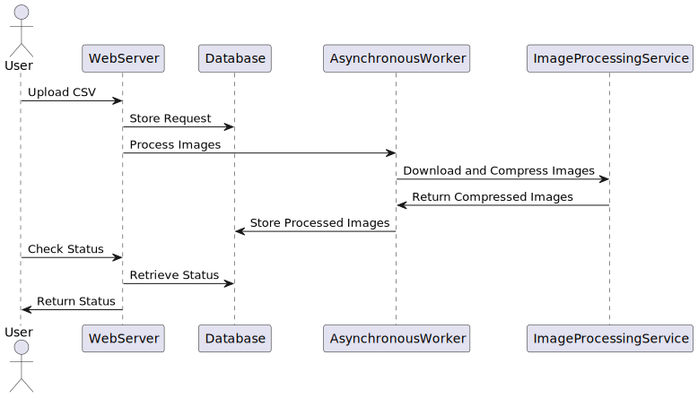

# Image Processing System

## Overview
This project is designed to efficiently process image data from CSV files. The system accepts a CSV file containing product information and image URLs, validates the data, processes the images asynchronously by compressing them, stores the processed image data and associated product information in a database, and provides APIs to check the processing status.

## Low-Level Design (LLD)

### Technical Design Document
The system is built using Python and Flask, with MongoDB as the database. The image processing is handled asynchronously using threads.

### Visual Diagram

### Components

#### Image Processing Service Interaction
- **Function**: Integrates with the asynchronous image processing service to compress images.
- **Implementation**: The `process_helper.py` file contains the logic to download, compress, and upload images.

#### Webhook Handling
- **Function**: Processes callbacks from the image processing service.
- **Implementation**: Not implemented in the current version.

#### Database Interaction
- **Function**: Stores and tracks the status of each processing request.
- **Implementation**: The `db.py` file contains functions to interact with MongoDB.

#### API Endpoints
- **Upload API**: Accepts CSV files and returns a unique request ID.
  - **Endpoint**: `/csv/upload`
  - **Method**: POST
  - **Request**: Multipart form-data with a file field named `file`.
  - **Response**: JSON with a unique `request_id`.

- **Status API**: Checks the processing status using the request ID.
  - **Endpoint**: `/csv/status/<request_id>`
  - **Method**: GET
  - **Response**: JSON with the processing status and product details.

### Database Schema
The database schema includes two collections:
- **processing_requests**: Stores the status of each processing request.
  - `request_id`: Unique identifier for the request.
  - `status`: Status of the request (e.g., pending, completed).
  - `created_at`: Timestamp of the request creation.

- **products**: Stores product information and image URLs.
  - `request_id`: Identifier linking the product to a processing request.
  - `serial_number`: Serial number of the product.
  - `product_name`: Name of the product.
  - `input_image_urls`: List of input image URLs.
  - `output_image_urls`: List of output image URLs.
  - `status`: Status of the product (e.g., pending, processed).

### Asynchronous Workers Documentation
The asynchronous worker function is implemented in `process_helper.py`. It processes images in a separate thread to avoid blocking the main application.

### GitHub Repository
The project code is available in the GitHub repository: [GitHub Repository](https://github.com/satyamrs00/moonbeams)

### Postman Collection
A Postman collection for testing the APIs is available at: [Postman Collection]([path/to/postman_collection.json](https://www.postman.com/satyamrs00/workspace/spyne/collection/23277225-30b3b8ea-826e-4a3d-a21e-13119fef6471?action=share&creator=23277225))